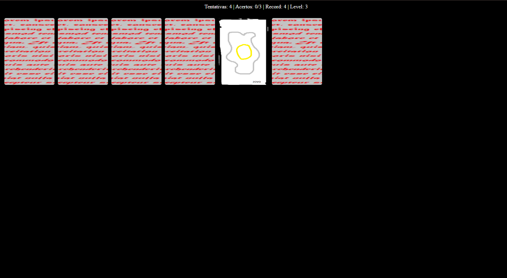
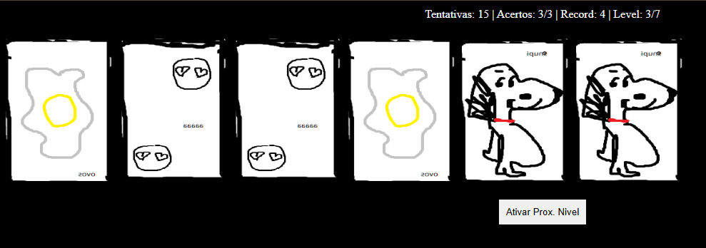

# memory-game

### Esse é um pequeno memory game feito em html/css/js 

Ele tem 7 níveis, aumentando cada vez mais a quantidade de cartas

Sistema de Ranking : Quando terminar todos os niveis fica salvo no localStorage o recorde a ser batido ! 

